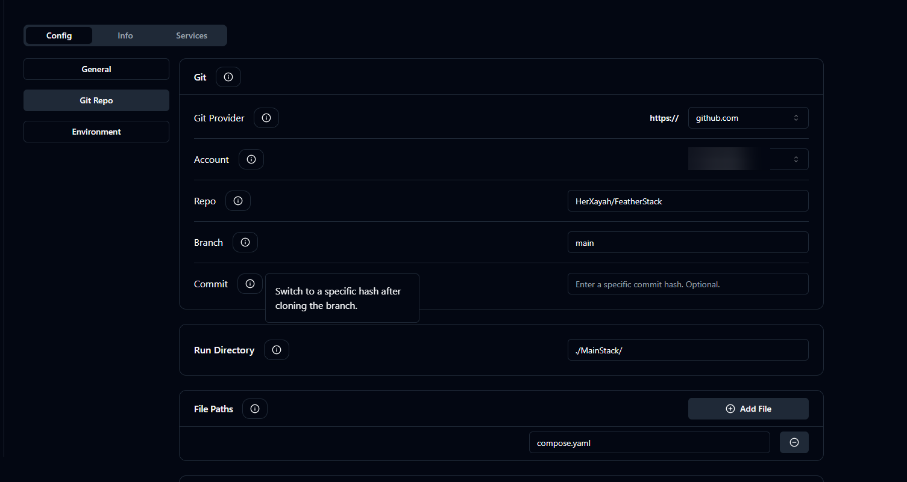
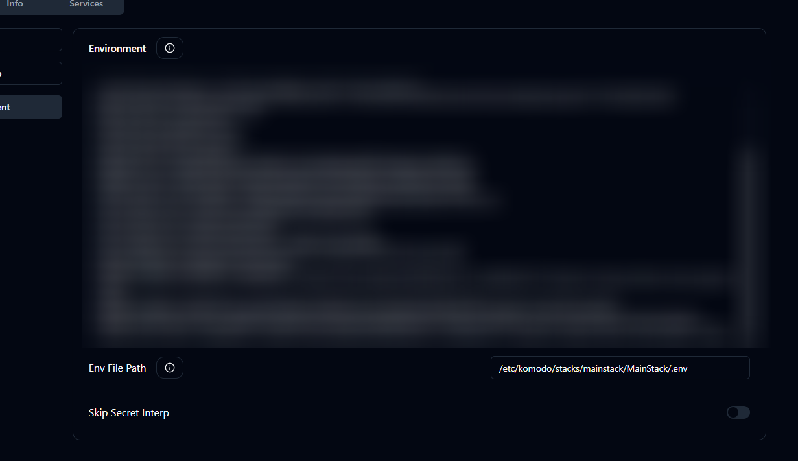

# FeatherStack

## What is this?

My Docker-Compose file i use in production.

## How to use?

1: Start komodo via `docker compose up -d`
2: Open the dashboard, enter data and press `singup`
3: Create a new sever and put put it like this

4: Create a new Stack and name it after the folder e.g `mainstack` for me
5: Setup a Git Repo

6: Setup a `.env` File or do it like me, but scuffed bc i use public version of this lol

*P.S, keep it to /etc/komodo/stacks/ because its the base path in the mount*

